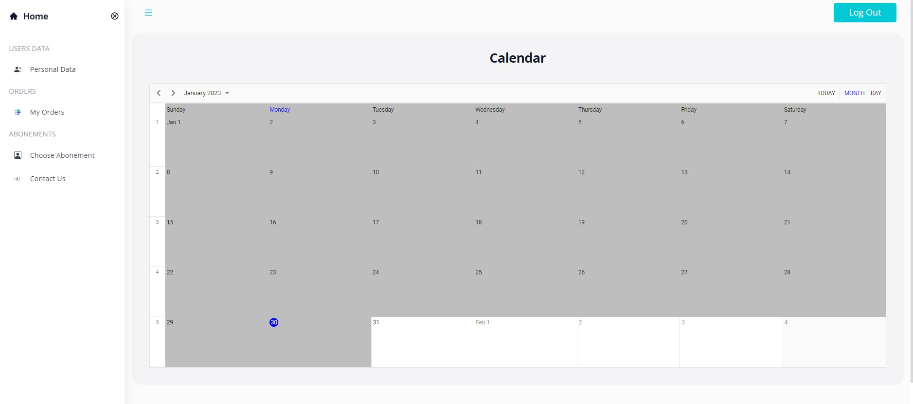

# Description
Diploma project for National School for Practical Engineers at the Technion /  פרויקט גמר הנדסאים טכניון

- Front-end programming languages: JavaScript, Typescript
- Front-end programming frameworks: ReactJS, Redux Toolkit, Syncfusion,Tailwind. 
- Back-end programming frameworks: NodeJS, Express. 
- NodeJS modules: nodemailer, jwtwebtoken, bcrypt, mongoose. 
- Database: MongoDB Atlas

## Showcase
### Main Page

### Sign Up

### Restore Password

### User Interface - Home

### User Interface - Personal Data

### User Interface - My Orders

### User Interface - Choose Abonement

### User Interface - Contact Us

### Admin Interface - Home

### Admin Interface - Settings

### Admin Interface - Add Abonement

### Admin Interface - Report

